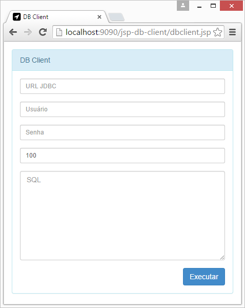

# jsp-db-client

Um cliente de banco de dados em uma única página JSP (Java Serve Pages).

## Para executar

Esse projeto usa [Maven](http://maven.apache.org).

Para executar utilizando linha de comando, vá para o diretório onde está o projeto, certifique-se que o Maven está devidamente instalado e configurado e em seguida execute `mvn tomcat7:run`.

Para executar no Eclipse, importe o projeto como um projeto Maven, execute a configuração de execução `jsp-db-client-mvn-tomcat7-run`. Para isso, clique no arquivo `/jsp-db-client/eclipse/jsp-db-client-mvn-tomcat7-run.launch` e execute a opção `Run > Run As < jsp-db-client-mvn-tomcat7-run`.

Em seguida acesse `http://localhost:9090/jsp-db-client/dbclient.jsp` em um navegador e veja o JSP DB Client em ação.

Esse projeto tem disponível o banco de dados [Derby](https://db.apache.org/derby/) e o seu driver JDBC. Para acessá-lo é bantante simples:

* Acesse a página (veja a imagem).

 

## Distributing

Para usar o JSP DB Client em sua própria aplicação, basta colocar o arquivo `dbclient.jsp`.

Esse arquivo utiliza alguns recursos na internet. Portanto, para utilizá-lo, é preciso acesso à internet.

## Compatibilidade

